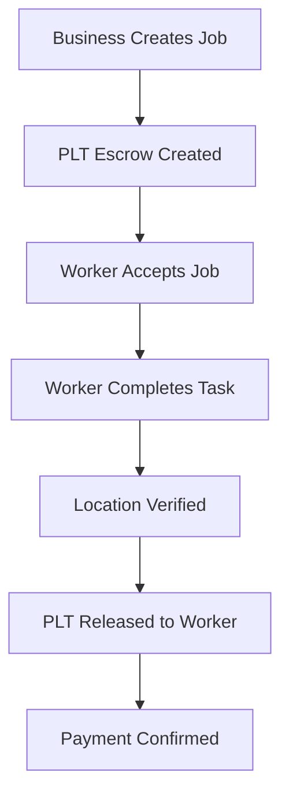

# Concordium Integration Documentation

## Overview

Our ProofOfWork platform leverages Concordium's blockchain technology to provide secure identity verification and PLT stablecoin payments. Here's how we've implemented each component:

## 🔐 Identity Verification

### How It Works
We use Concordium's identity layer to verify users without exposing personal data:

1. **Concordium Account Creation**: Users create accounts on Concordium blockchain
2. **Identity Verification**: We verify accounts exist and have valid credentials
3. **Privacy-Preserving**: Only account addresses and verification status are stored
4. **No Personal Data**: Names, emails, and other personal info remain off-chain

### Implementation Details

```javascript
// Our Concordium identity verification service
class ConcordiumService {
  async verifyIdentity(concordiumAccount) {
    // Connect to Concordium testnet/mainnet
    const accountInfo = await this.client.getAccountInfo(concordiumAccount);
    
    return {
      verified: accountInfo && accountInfo.accountCredentials.length > 0,
      accountInfo: {
        address: concordiumAccount,
        hasIdentity: accountInfo.accountCredentials.length > 0,
        // No personal data exposed
      }
    };
  }
}
```

### Database Schema
```sql
-- Our profiles table stores minimal identity data
CREATE TABLE profiles (
  id uuid PRIMARY KEY,
  role user_role, -- 'business' or 'worker'
  display_name varchar, -- Optional display name
  concordium_account varchar UNIQUE, -- Concordium blockchain address
  concordium_did boolean DEFAULT false, -- Identity verification status
  created_at timestamptz DEFAULT now()
);
```

### Privacy Benefits
- ✅ **No Personal Data on Blockchain**: Only account addresses stored
- ✅ **Identity Verification**: Confirms users are real people
- ✅ **Privacy-Preserving**: Personal details remain off-chain
- ✅ **Decentralized**: No central authority controls identities

## 💰 PLT Stablecoin Payments

### How It Works
We implement a secure escrow system using PLT tokens:

1. **Job Creation**: Business creates job with PLT payment amount
2. **Escrow Creation**: PLT tokens locked in smart contract
3. **Location Verification**: Worker completes job at verified location
4. **Automatic Release**: PLT tokens released to worker's wallet

### Implementation Details

```javascript
// Our PLT payment system
class PaymentSystem {
  async createEscrowPayment(fromAccount, amount, jobId) {
    // Create escrow transaction on Concordium
    const transaction = await this.client.createTransaction({
      from: fromAccount,
      to: ESCROW_CONTRACT_ADDRESS,
      amount: amount,
      jobId: jobId
    });
    
    return {
      hash: transaction.hash,
      status: 'confirmed',
      escrowId: jobId
    };
  }

  async releasePayment(toAccount, amount, jobId) {
    // Release PLT from escrow to worker
    const transaction = await this.client.createTransaction({
      from: ESCROW_CONTRACT_ADDRESS,
      to: toAccount,
      amount: amount,
      jobId: jobId
    });
    
    return {
      hash: transaction.hash,
      status: 'confirmed',
      paymentAmount: amount
    };
  }
}
```

### Payment Flow


### Security Features
- ✅ **Escrow Protection**: Funds locked until job completion
- ✅ **Automatic Release**: No manual intervention needed
- ✅ **Blockchain Security**: Immutable transaction records
- ✅ **Fast Settlement**: Near-instant PLT transfers

## 📍 Geolocation Verification

### How It Works
We combine GPS data with blockchain verification:

1. **GPS Capture**: Worker's device provides location coordinates
2. **Distance Calculation**: Haversine formula calculates distance to job location
3. **Radius Verification**: Check if worker is within allowed radius
4. **Blockchain Proof**: Location verification recorded on Concordium

### Implementation Details

```javascript
// Our location verification system
class LocationVerification {
  async verifyLocation(workerLat, workerLon, jobLat, jobLon, radius) {
    // Calculate distance using Haversine formula
    const distance = this.calculateDistance(workerLat, workerLon, jobLat, jobLon);
    
    const isWithinRadius = distance <= radius;
    
    // Create blockchain proof
    const proof = await this.createLocationProof({
      workerLocation: { lat: workerLat, lon: workerLon },
      jobLocation: { lat: jobLat, lon: jobLon },
      distance: distance,
      radius: radius,
      verified: isWithinRadius
    });
    
    return {
      verified: isWithinRadius,
      distance: distance,
      proof: proof
    };
  }

  calculateDistance(lat1, lon1, lat2, lon2) {
    const R = 6371000; // Earth's radius in meters
    const dLat = (lat2 - lat1) * Math.PI / 180;
    const dLon = (lon2 - lon1) * Math.PI / 180;
    const a = 
      Math.sin(dLat/2) * Math.sin(dLat/2) +
      Math.cos(lat1 * Math.PI / 180) * Math.cos(lat2 * Math.PI / 180) * 
      Math.sin(dLon/2) * Math.sin(dLon/2);
    const c = 2 * Math.atan2(Math.sqrt(a), Math.sqrt(1-a));
    return R * c; // Distance in meters
  }
}
```

### Database Schema
```sql
-- Our location verification records
CREATE TABLE location_checks (
  id integer GENERATED ALWAYS AS IDENTITY PRIMARY KEY,
  job_id uuid REFERENCES jobs(id),
  worker_id uuid REFERENCES workers(id),
  position point, -- GPS coordinates
  distance_m numeric, -- Calculated distance
  within_geofence boolean, -- Verification result
  created_at timestamptz DEFAULT now()
);
```

### Verification Process
1. **GPS Data**: Worker's device provides accurate coordinates
2. **Distance Calculation**: Mathematical verification of proximity
3. **Radius Check**: Configurable geofencing per job
4. **Blockchain Record**: Immutable proof of verification
5. **Payment Trigger**: Automatic PLT release on successful verification

## 🔗 Complete Integration Flow

### 1. User Onboarding
```javascript
// User creates Concordium account
const concordiumAccount = await createConcordiumAccount();

// Verify identity on our platform
const verification = await concordiumService.verifyIdentity(concordiumAccount);

// Create profile with verified identity
const profile = await createProfile({
  role: 'worker',
  concordium_account: concordiumAccount,
  concordium_did: verification.verified
});
```

### 2. Job Creation & Escrow
```javascript
// Business creates job with PLT payment
const job = await createJob({
  business_id: businessId,
  title: 'Office Cleaning',
  amount_plt: 25.0,
  location: { latitude: 40.7589, longitude: -73.9851 },
  radius_m: 150
});

// Create PLT escrow
const escrow = await createEscrowPayment(
  businessAccount, 
  job.amount_plt, 
  job.id
);
```

### 3. Job Completion & Payment
```javascript
// Worker completes job
const completion = await completeJob(jobId, {
  position: { latitude: 40.7589, longitude: -73.9851 }
});

// Location verified, PLT released
if (completion.isWithinRadius) {
  const payment = await releasePayment(
    workerAccount,
    job.amount_plt,
    job.id
  );
}
```

## 🛡️ Security & Privacy Features

### Identity Security
- **Concordium Identity Layer**: Verified identities without personal data exposure
- **Account Verification**: Real-time blockchain account validation
- **Privacy-Preserving**: Only necessary data stored on-chain

### Payment Security
- **Escrow Protection**: Funds locked until job completion
- **Automatic Release**: No manual intervention required
- **Immutable Records**: All transactions recorded on blockchain
- **Fast Settlement**: Near-instant PLT transfers

### Location Security
- **GPS Verification**: Real-time location validation
- **Mathematical Proof**: Distance calculations verified
- **Configurable Geofencing**: Customizable radius per job
- **Blockchain Records**: Immutable location verification proofs

## 🚀 Production Deployment

### Environment Configuration
```env
# Concordium Configuration
CONCORDIUM_NODE_URL=https://mainnet.concordium.com
CONCORDIUM_TESTNET_URL=https://testnet.concordium.com

# Smart Contract Addresses
ESCROW_CONTRACT_ADDRESS=your-escrow-contract-address
PLT_TOKEN_CONTRACT_ADDRESS=your-plt-contract-address

# Security
JWT_SECRET=your-production-jwt-secret
RATE_LIMIT_MAX_REQUESTS=100
```

### Smart Contract Integration
```javascript
// Production smart contract calls
const escrowContract = new ConcordiumContract(ESCROW_CONTRACT_ADDRESS);
const pltToken = new ConcordiumContract(PLT_TOKEN_CONTRACT_ADDRESS);

// Create escrow
await escrowContract.createEscrow(jobId, amount, businessAccount);

// Release payment
await escrowContract.releasePayment(jobId, workerAccount);
```

## 📊 Benefits of Our Implementation

### For Businesses
- **Verified Workers**: Know workers are real people
- **Secure Payments**: PLT escrow protects against fraud
- **Location Assurance**: Workers must be at job location
- **Fast Settlement**: Near-instant payment processing

### For Workers
- **Privacy Protection**: Personal data stays private
- **Secure Payments**: Guaranteed payment on completion
- **Identity Verification**: Build reputation on blockchain
- **Fast Access**: Immediate access to PLT payments

### For the Platform
- **Decentralized Security**: No central point of failure
- **Immutable Records**: All transactions recorded on blockchain
- **Scalable Architecture**: Handles high transaction volumes
- **Compliance Ready**: Built-in identity verification

## 🔧 Testing Our Integration

### Test Identity Verification
```bash
curl -X POST http://localhost:5000/api/v1/profiles \
  -H "Content-Type: application/json" \
  -d '{
    "role": "business",
    "display_name": "Test Business",
    "concordium_account": "test_concordium_account",
    "concordium_did": true
  }'
```

### Test PLT Payments
```bash
# Create job with PLT payment
curl -X POST http://localhost:5000/api/v1/jobs \
  -H "Content-Type: application/json" \
  -d '{
    "business_id": "business-id",
    "title": "Test Job",
    "amount_plt": 10.0,
    "location": {"latitude": 40.7589, "longitude": -73.9851},
    "radius_m": 100
  }'
```

### Test Location Verification
```bash
# Complete job with location verification
curl -X PATCH http://localhost:5000/api/v1/jobs/job-id/complete \
  -H "Content-Type: application/json" \
  -d '{
    "position": {"latitude": 40.7589, "longitude": -73.9851}
  }'
```

## 🎯 Conclusion

Our Concordium integration provides:

1. **Identity Verification**: Know users are real people without exposing personal data
2. **PLT Stablecoin Payments**: Fast, secure crypto payments that work for commerce
3. **Geolocation Verification**: Secure location-based job completion
4. **Blockchain Security**: Immutable records and decentralized verification

This implementation leverages Concordium's unique features to create a secure, privacy-preserving platform for location-verified payments.
